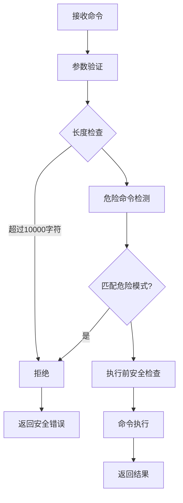
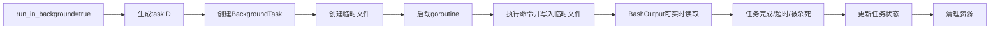

# CLAUDE.md

This file provides guidance to Claude Code (claude.ai/code) when working with code in this repository.

## 🚀 项目概述

这是一个**企业级MCP Bash Tools**项目，基于Go语言实现，专为安全执行PowerShell/Bash命令而设计。项目采用MCP（Model Context Protocol）协议，提供三个核心工具：

1. **Bash工具** - 安全执行PowerShell命令（支持超时、前台/后台执行）
2. **BashOutput工具** - 获取后台命令的实时输出（支持正则过滤）
3. **KillShell工具** - 终止后台运行的命令

### ✨ 核心特性

- ✅ **企业级安全** - 多层安全验证（认证、速率限制、命令白名单/黑名单）
- ✅ **沙箱隔离** - 可选沙箱执行环境，资源限制
- ✅ **智能Shell检测** - 自动检测并使用最优Shell（PowerShell 7 > Git Bash > PowerShell > CMD）
- ✅ **Windows优化** - 原生支持UTF-8编码、虚拟终端处理、路径优化
- ✅ **并发安全** - 使用sync.RWMutex保证后台任务管理安全
- ✅ **实时输出** - 后台任务使用临时文件实时存储输出
- ✅ **资源管理** - 最大输出限制、内存/CPU限制、进程数控制

## 📋 常用命令

### 构建项目
```powershell
# 调试模式构建（默认）
.\build.ps1

# 发布模式构建
.\build.ps1 -Release

# 清理缓存并重新构建
.\build.ps1 -Clean

# 详细输出模式
.\build.ps1 -Verbose

# 编译单个文件（测试用）
go build -o dist/bash-tools.exe ./cmd/server
```

### 运行和测试
```powershell
# 直接运行服务器
go run ./cmd/server

# 运行所有测试
go test ./...

# 运行特定包测试
go test ./internal/executor

# 运行测试并查看覆盖率
go test -cover ./...

# 运行单个测试文件
go test -v ./internal/security/security_test.go

# 性能测试
go test -bench=. ./...

# 启用竞态检测
go test -race ./...
```

### 代码质量检查
```powershell
# 格式化代码
go fmt ./...

# 静态分析
go vet ./...

# 下载依赖
go mod download

# 整理依赖
go mod tidy

# 检查模块依赖
go mod graph
```

## 🏗️ 架构设计

### 整体架构
```
┌─────────────────────────────────────────┐
│           cmd/server/main.go            │
│        MCP服务器 (Port: stdio)           │
│      • Bash/BashOutput/KillShell        │
└─────────┬───────────────┬───────────────┘
          │               │
          ▼               ▼
    ┌───────────┐   ┌──────────────┐
    │ MCPServer │   │  mcp.Server  │
    │           │   │  (SDK)       │
    │ • Bash    │   └──────────────┘
    │ • BashOut │
    │ • Kill    │
    └─────┬─────┘
          │
    ┌─────┴────────────────────────────────────┐
    │           核心业务层                        │
    ├──────────────────────────────────────────┤
    │ 1. 执行器层 (internal/executor/)          │
    │    ├── bash.go - 基础Bash执行器            │
    │    ├── shell.go - Shell环境检测管理        │
    │    └── secure_bash.go - 安全执行器(558行)   │
    │                                              │
    │ 2. 安全层 (internal/security/)             │
    │    ├── security.go - 安全管理器(561行)     │
    │    └── validator.go - 命令验证器(213行)     │
    │                                              │
    │ 3. Windows优化 (internal/windows/)         │
    │    └── optimize.go - Windows特定优化       │
    └────────────────┬───────────────────────────┘
                     │
            ┌────────┴────────┐
            ▼                 ▼
      ┌──────────┐     ┌─────────────┐
      │ 后台任务   │     │    工具包     │
      │ 管理器     │     │             │
      │ (map+锁)  │     │ • logger    │
      └──────────┘     │ • utils     │
                       └─────────────┘
```

### 三层架构详解

#### L1 - MCP接口层 (`cmd/server/main.go`)
- **职责**: MCP协议实现，工具注册，HTTP/stdio传输
- **核心**: MCPServer结构体，维护`backgroundTasks`映射表
- **工具**: 3个MCP工具（Bash、BashOutput、KillShell）
- **通信**: 使用stdio传输，与MCP客户端通信

#### L2 - 业务逻辑层
**执行器组件** (`internal/executor/`)
- `ShellExecutor`: 智能Shell检测（PowerShell7→GitBash→PowerShell→CMD）
- `SecureBashExecutor`: 企业级安全执行器（沙箱、资源限制、安全验证）
- `BashExecutor`: 基础命令执行器（流式输出、超时控制）

**安全组件** (`internal/security/`)
- `SecurityManager`: 安全策略中心（认证、速率限制、审计日志）
- `CommandValidator`: 命令验证器（正则过滤、危险命令检测）
- `JWTAuthProvider`: JWT认证实现（Token生成/验证）

**Windows优化** (`internal/windows/`)
- `OptimizedCommandExecutor`: Windows特定优化（UTF-8、虚拟终端）
- 路径优化、长路径支持(`\\?\`前缀)

#### L3 - 基础设施层
- `BackgroundTask`结构体: 后台任务元数据（ID、状态、输出、临时文件）
- `sync.RWMutex`: 并发控制（读写锁保护任务映射表）
- 临时文件系统: `os.CreateTemp()`实时存储后台输出

### 核心模块详解

#### 1. **执行器层** (`internal/executor/`) - 558/240/183行
- `secure_bash.go` (558行) - **企业级安全执行器**
  - 多层安全验证（命令白名单/黑名单、正则过滤）
  - 资源限制（内存512MB、CPU 80%、进程数10）
  - 沙箱隔离（可选RequireSandbox模式）
  - 超时控制（支持context.WithTimeout）
  - 实时输出监控（流式读取、10MB输出限制）
- `shell.go` (183行) - **智能Shell管理器**
  - 自动检测Shell优先级：PowerShell7 → GitBash → PowerShell → CMD
  - Shell路径缓存（map[ShellType]string）
  - 环境变量优化（TERM=xterm-256color, PROMPT=$P$G）
- `bash.go` (240行) - **基础命令执行器**
  - 简单命令执行（Execute方法）
  - 流式输出支持（ExecuteWithStreaming）
  - 进程管理（StartBackgroundCommand、KillProcess）
  - 超时处理（context.DeadlineExceeded检测）

#### 2. **安全模块** (`internal/security/`) - 561/213行
- `security.go` (561行) - **安全管理中心**
  - **认证**: JWTAuthProvider（Token生成/验证）
  - **速率限制**: TokenBucket算法（默认10 RPS/20 Burst）
  - **审计**: SecurityEvent日志（事件追踪）
  - **权限**: 基于Permission的访问控制
- `validator.go` (213行) - **命令验证器**
  - 危险命令检测（rm -rf、mkfs、format等70+模式）
  - 正则过滤（blockedPatterns数组）
  - 引号内命令安全检查（isEntireCommandQuoted）
  - 管道/重定向安全验证（isSafePipeUsage、isSafeRedirectUsage）

#### 3. **Windows优化** (`internal/windows/`) - 220行
- `optimize.go` - **Windows原生优化**
  - UTF-8编码设置（SetConsoleOutputCP）
  - 虚拟终端处理（ENABLE_VIRTUAL_TERMINAL_PROCESSING）
  - 长路径支持（`\\?\`前缀）
  - GitBash自动检测（5个常见路径）
  - 环境变量优化（PYTHONIOENCODING=utf-8）

#### 4. **工具包** (`pkg/`)
- `logger/` - 结构化日志（logrus封装）
- `utils/` - 通用工具函数

### MCP工具实现模式

所有MCP工具遵循统一的三层模式：

#### 1️⃣ Tool定义层
```go
// 定义工具规范（Name、Description、InputSchema）
mcp.AddTool(server, &mcp.Tool{
    Name:        "Bash",
    Description: "安全执行PowerShell命令",
}, bashServer.BashHandler)
```

#### 2️⃣ Handler处理层
```go
// 核心处理函数签名
func (s *MCPServer) BashHandler(
    ctx context.Context, 
    req *mcp.CallToolRequest, 
    input BashInput
) (*mcp.CallToolResult, BashOutput, error) {
    // ① 参数验证 → ② 安全检查 → ③ 执行命令 → ④ 返回结果
}
```

#### 3️⃣ Result返回层
```go
// MCP标准返回格式
return &mcp.CallToolResult{
    Content: []mcp.Content{
        &mcp.TextContent{Text: output},
    },
}, result, nil
```

### 三大核心工具

| 工具 | 输入参数 | 输出 | 核心功能 |
|------|----------|------|----------|
| **Bash** | command, timeout, run_in_background | output, exitCode, shellId | 安全执行命令（前台/后台） |
| **BashOutput** | bash_id, filter | output, status, exitCode | 获取后台任务实时输出 |
| **KillShell** | shell_id | message, shell_id | 终止后台任务 |

#### 🔒 Bash工具安全检查流程


#### ⚡ 后台任务执行流程


## 🔧 开发指南

### 开发流程
1. **修改代码** → 2. **运行测试** → 3. **构建验证** → 4. **提交代码**

### 💻 常用开发任务

#### 添加新的MCP工具
```go
// 1. 定义输入输出结构体
type NewToolInput struct {
    Param1 string `json:"param1"`
    Param2 int    `json:"param2,omitempty"`
}

type NewToolOutput struct {
    Result string `json:"result"`
}

// 2. 在MCPServer中实现Handler
func (s *MCPServer) NewToolHandler(ctx context.Context, req *mcp.CallToolRequest, input NewToolInput) (*mcp.CallToolResult, NewToolOutput, error) {
    // 实现逻辑
    return &mcp.CallToolResult{}, NewToolOutput{}, nil
}

// 3. 在main()中注册工具
mcp.AddTool(server, &mcp.Tool{
    Name: "new-tool",
    Description: "新工具描述",
}, bashServer.NewToolHandler)
```

#### 添加新的安全检查
```go
// 在 internal/security/validator.go 中添加
func (cv *CommandValidator) isCustomDangerous(command string) bool {
    // 自定义危险命令检测逻辑
    return false
}
```

#### 修改Shell检测逻辑
```go
// 在 internal/executor/shell.go 的 detectShells() 方法中
// 添加新的Shell检测逻辑
```

### 🔒 安全最佳实践

1. **命令验证**
   - 所有新命令必须通过`CommandValidator.Validate()`
   - 禁止添加危险命令到白名单
   - 敏感操作需要添加额外验证

2. **并发安全**
   - 访问`backgroundTasks`必须使用`mutex`
   - 读操作：`mutex.RLock()` / `mutex.RUnlock()`
   - 写操作：`mutex.Lock()` / `mutex.Unlock()`

3. **错误处理**
   - 所有错误都应该被记录（使用logger）
   - 返回给MCP客户端的错误不应包含敏感信息
   - 避免在错误信息中泄露系统路径或配置

4. **测试要求**
   - 新功能必须包含单元测试
   - 安全相关功能需要额外的安全测试
   - 运行`go test -race`检查竞态条件

### 📦 依赖管理
- **MCP SDK**: 使用本地路径 `./go-sdk`
- **日志库**: `github.com/sirupsen/logrus v1.9.3`
- **测试库**: `github.com/stretchr/testify v1.11.1`
- **Go版本**: 需要Go 1.23.0+

### ⚙️ 配置参数

| 参数 | 默认值 | 说明 | 可配置位置 |
|------|--------|------|------------|
| 最大命令长度 | 10000字符 | 安全验证 | `ValidationConfig.MaxCommandLength` |
| 速率限制 | 10 RPS/20 Burst | 防止滥用 | `RateLimiterConfig` |
| 默认超时 | 30秒 | 后台任务 | `executeBackgroundCommand()` |
| 最大超时 | 600秒 | 所有任务 | `BashInput.Timeout` |
| 最大输出 | 10MB | 防止内存溢出 | `SecureBashExecutor.maxOutputSize` |
| 最大任务数 | 50个 | 并发限制 | `backgroundTasks` map |

## 📁 重要文件位置

| 文件路径 | 行数 | 描述 |
|---------|------|------|
| **核心入口** | |
| `cmd/server/main.go` | 490 | MCP服务器主程序，定义3个工具 |
| **执行器层** | |
| `internal/executor/secure_bash.go` | 558 | 企业级安全执行器（沙箱、资源限制） |
| `internal/executor/shell.go` | 183 | Shell环境检测与管理 |
| `internal/executor/bash.go` | 240 | 基础命令执行器 |
| **安全层** | |
| `internal/security/security.go` | 561 | 安全管理中心（认证、限流、审计） |
| `internal/security/validator.go` | 213 | 命令验证器（危险命令检测） |
| **Windows优化** | |
| `internal/windows/optimize.go` | 220 | Windows特定优化（UTF-8、虚拟终端） |
| **工具包** | |
| `pkg/logger/logger.go` | - | 结构化日志系统 |
| `pkg/utils/utils.go` | - | 通用工具函数 |
| **构建配置** | |
| `build.ps1` | 233 | PowerShell构建脚本 |
| `go.mod` | 22 | Go模块依赖 |
| `go-sdk/` | - | MCP Go SDK（本地替换） |

### 🧪 测试文件

| 测试文件 | 描述 |
|---------|------|
| `test_fix.go` | 后台任务输出修复验证 |
| `validate_fix.go` | 修复效果验证 |
| `go-sdk/mcp/*_test.go` | MCP SDK测试套件 |
| `go-sdk/auth/*_test.go` | 认证模块测试 |

## 🎯 测试建议

### 测试策略
采用**金字塔测试模型**：
- **70% 单元测试** - 验证单个函数/方法
- **20% 集成测试** - 验证模块间协作
- **10% 端到端测试** - 验证完整工作流

### 测试覆盖重点

#### 1. **安全模块测试** (`internal/security/`)
```powershell
go test -v -cover ./internal/security
```
**测试场景**:
- ✅ 危险命令过滤（rm -rf、format、shutdown等）
- ✅ 正则表达式匹配准确性
- ✅ 引号内命令安全验证
- ✅ 管道/重定向安全检查
- ✅ 速率限制算法（TokenBucket）
- ✅ JWT认证流程
- ✅ 权限验证逻辑

#### 2. **执行器测试** (`internal/executor/`)
```powershell
go test -race -cover ./internal/executor
```
**测试场景**:
- ✅ 前台命令执行（超时、正常、错误）
- ✅ 后台命令执行（实时输出、状态更新）
- ✅ Shell检测准确性（PowerShell7→GitBash→PowerShell→CMD）
- ✅ 沙箱执行模式
- ✅ 资源限制（内存、CPU、进程数）
- ✅ 并发安全（竞态条件检测）

#### 3. **MCP工具测试** (`cmd/server/`)
```powershell
go test -v -timeout 60s ./cmd/server
```
**测试场景**:
- ✅ Bash工具（前台/后台执行、超时处理）
- ✅ BashOutput工具（实时输出、正则过滤）
- ✅ KillShell工具（任务终止、资源清理）
- ✅ 参数验证（长度、范围、类型）
- ✅ 错误处理（安全错误、参数错误）
- ✅ 任务管理（创建、查询、删除）

#### 4. **集成测试** - 完整工作流
```powershell
go test -v -run TestIntegration ./...
```
**测试流程**:
1. 启动MCP服务器 → 2. 调用Bash工具 → 3. 验证输出 → 4. 调用BashOutput → 5. 调用KillShell → 6. 清理资源

### 运行特定测试命令

#### 基础测试
```powershell
# 运行所有测试
go test ./...

# 查看覆盖率
go test -coverprofile=coverage.out ./...
go tool cover -html=coverage.out -o coverage.html

# 并发安全检测
go test -race ./...

# 详细输出
go test -v ./...

# 超时设置
go test -timeout 60s ./...
```

#### 模块测试
```powershell
# 安全模块（重点测试）
go test -v -cover ./internal/security/...

# 执行器模块（竞态检测）
go test -race -cover ./internal/executor/...

# Windows优化模块
go test -v ./internal/windows/...

# 主服务器（集成测试）
go test -v -timeout 30s ./cmd/server/...
```

#### 性能测试
```powershell
# 基准测试
go test -bench=. -benchmem ./...

# 内存分析
go test -bench=. -memprofile=mem.out ./...

# CPU分析
go test -bench=. -cpuprofile=cpu.out ./...
```

### 编写测试指南

#### 单元测试模板
```go
func TestFunctionName(t *testing.T) {
    // Arrange - 准备测试数据
    input := "test command"
    expected := "expected output"
    
    // Act - 执行被测函数
    result, err := FunctionUnderTest(input)
    
    // Assert - 验证结果
    assert.NoError(t, err)
    assert.Equal(t, expected, result)
}
```

#### 并发测试模板
```go
func TestConcurrentAccess(t *testing.T) {
    const numGoroutines = 10
    
    var wg sync.WaitGroup
    wg.Add(numGoroutines)
    
    for i := 0; i < numGoroutines; i++ {
        go func() {
            defer wg.Done()
            // 并发操作
            result, err := FunctionUnderTest("concurrent command")
            assert.NoError(t, err)
            assert.NotEmpty(t, result)
        }()
    }
    
    wg.Wait()
}
```

#### 模拟测试模板
```go
func TestWithMock(t *testing.T) {
    // 创建模拟对象
    mockExecutor := new(MockExecutor)
    mockExecutor.On("Execute", "test command").Return("mocked output", 0, nil)
    
    // 使用模拟对象
    server := &MCPServer{
        shellExecutor: mockExecutor,
        // ...
    }
    
    result, err := server.BashHandler(...)
    assert.NoError(t, err)
    assert.Equal(t, "mocked output", result.Output)
}
```

### 测试数据管理

#### 危险命令测试集
```go
var dangerousCommands = []struct{
    command string
    shouldBlock bool
}{
    {"rm -rf /", true},
    {"format C:", true},
    {"shutdown /s", true},
    {"echo 'hello'", false},
    {"ls -la", false},
}
```

#### 边界值测试
```powershell
# 空命令
# 超长命令（10001字符）
# 特殊字符（; | & $ `）
# Unicode字符
# 超时边界值（1ms, 600000ms）
```

### 持续集成检查清单

- [ ] 所有测试通过（`go test ./...`）
- [ ] 覆盖率 > 80%（`go test -cover ./...`）
- [ ] 无竞态条件（`go test -race ./...`）
- [ ] 无静态分析问题（`go vet ./...`）
- [ ] 代码格式化（`go fmt ./...`）
- [ ] 性能基准测试通过（`go test -bench=. ./...`）

**💡 提示**: 每次提交前必须运行完整测试套件！使用 `./build.ps1` 自动运行所有检查。

## 🚨 已知限制

### 平台限制
- **仅支持Windows x64平台**
  - Go版本：1.23.0+
  - 目标架构：`GOOS=windows GOARCH=amd64`
  - CGO禁用：`CGO_ENABLED=0`
- **Shell环境要求**
  - 推荐：**PowerShell 7+** (pwsh)
  - 备选：Git Bash、PowerShell 5+、CMD
  - 最低要求：任意一种Shell可执行

### 资源限制
| 限制项 | 默认值 | 说明 |
|--------|--------|------|
| 最大后台任务数 | **50个** | `backgroundTasks` map大小 |
| 单次命令超时 | **600秒** | BashInput.Timeout最大值 |
| 默认超时 | **30秒** | 后台任务默认超时 |
| 最大输出大小 | **10MB** | SecureBashExecutor.maxOutputSize |
| 最小超时 | **1秒** | BashInput.Timeout最小值 |
| 最大命令长度 | **10000字符** | ValidationConfig.MaxCommandLength |

### 性能限制
- **内存限制**：单命令最大512MB（SecureBashExecutor）
- **CPU限制**：最大80%使用率
- **进程限制**：单任务最多10个子进程
- **磁盘限制**：沙箱模式最大100MB
- **网络限制**：默认禁止网络访问（沙箱模式）

### 安全限制
- **认证**：JWT Token（默认启用，可配置禁用）
- **速率限制**：默认10 RPS/20 Burst（可配置）
- **路径限制**：沙箱模式工作目录限制
- **命令限制**：70+危险命令黑名单

### 功能限制
- **平台专用**：Windows优化功能在其他平台不可用
  - UTF-8编码设置
  - 虚拟终端处理（ANSI颜色）
  - 长路径支持（`\\?\`前缀）
- **临时文件**：后台任务输出存储在系统临时目录
  - 路径：`os.TempDir()/bash_output_*.txt`
  - 生命周期：任务期间创建，结束后自动清理
- **并发限制**：使用sync.RWMutex，不支持无限制并发

### 兼容性限制
- **Go SDK**：使用本地 `./go-sdk` 替换官方SDK
  - 无法使用 `go get` 自动更新
  - 需要手动同步上游更新
- **依赖版本**：
  - logrus: v1.9.3（固定版本）
  - testify: v1.11.1（固定版本）
  - Go 1.23.0（最低要求）

### 文档限制
- 部分文档文件可能不存在（如 `docs/README.md`、`docs/protocol.md`）
- 实际存在文档：
  - 本文件（CLAUDE.md）
  - go-sdk内部文档（注释）

### 测试限制
- 集成测试依赖完整MCP环境
- Windows特定测试在其他平台跳过
- 某些安全测试需要管理员权限

## 📚 参考文档

### 📄 项目文档
- **本文件** (`CLAUDE.md`) - 项目开发指南（当前文档）
- **构建脚本** (`build.ps1`) - PowerShell构建脚本（233行，详尽注释）

### 📦 依赖文档
- **MCP Go SDK** (`go-sdk/`) - 本地MCP SDK实现
  - `go-sdk/README.md` - SDK使用指南
  - `go-sdk/mcp/*.go` - MCP协议实现
  - `go-sdk/examples/` - 完整示例集合
    - `examples/client/` - 客户端示例
    - `examples/server/` - 服务器示例
    - `examples/http/` - HTTP传输示例

### 🔗 外部文档链接
- **MCP协议规范**: https://modelcontextprotocol.io/
- **Go官方文档**: https://golang.org/doc/
- **PowerShell 7文档**: https://docs.microsoft.com/powershell/
- **logrus日志库**: https://github.com/sirupsen/logrus
- **testify测试库**: https://github.com/stretchr/testify

### 📖 代码内文档
- 所有Go文件都有详细注释
- 核心函数前都有文档字符串
- 复杂逻辑块有内联注释

### 🔍 代码注释规范
```go
// 函数名 - 功能描述
// 参数说明
// 返回值说明
// 使用示例（如适用）
func ExampleFunction(param1 string, param2 int) (result string, err error) {
    // 实现逻辑
}
```

### 📝 提交历史
- 查看 `git log` 获取开发历史
- 最近提交：`54ac720 [修复] 修复后台任务输出为空问题`
- 首次提交：`3fd91c1 first commit`

### 📊 代码统计
```
总文件数：117个Go文件
核心业务：8个文件（internal/* + cmd/server/main.go）
SDK代码：109个文件（go-sdk/）
测试文件：多个（*_test.go）
```

## 🔍 故障排除

### 🚧 常见问题与解决方案

#### 构建失败

**问题1：Go版本不兼容**
```powershell
# 错误：go: cannot find main module
go version
# 需要：Go 1.23.0+
```
**解决**：
```powershell
# 升级Go到1.23.0+
# 下载：https://golang.org/dl/

# 验证版本
go version
# 应该显示：go version go1.23.x windows/amd64
```

**问题2：模块依赖问题**
```powershell
# 错误：go: github.com/modelcontextprotocol/go-sdk: malformed module path
```
**解决**：
```powershell
# 清理缓存
go clean -modcache
go mod download

# 重新替换本地SDK（确保路径正确）
go mod edit -replace github.com/modelcontextprotocol/go-sdk=./go-sdk
go mod tidy
```

**问题3：构建脚本执行失败**
```powershell
# PowerShell错误：ExecutionPolicy
```
**解决**：
```powershell
# 查看执行策略
Get-ExecutionPolicy

# 临时绕过（当前会话）
Set-ExecutionPolicy -ExecutionPolicy Bypass -Scope Process

# 或以管理员身份运行
# 右键PowerShell → 以管理员身份运行
```

**问题4：交叉编译失败**
```powershell
# 错误：unknown runtime environment: windows/amd64
```
**解决**：
```powershell
# 设置环境变量
$env:GOOS = "windows"
$env:GOARCH = "amd64"
$env:CGO_ENABLED = "0"

# 或使用build.ps1
.\build.ps1 -Verbose
```

---

#### 测试失败

**问题1：测试超时**
```powershell
# 错误：FAIL: test timed out after 30s
```
**解决**：
```powershell
# 增加超时时间
go test -v -timeout 60s ./...

# 单独运行超时测试
go test -v -timeout 120s ./internal/executor/...
```

**问题2：竞态条件**
```powershell
# 错误：WARNING: DATA RACE
```
**解决**：
```powershell
# 启用竞态检测
go test -race -v ./...

# 修复并发问题
# - 确保所有共享状态都有锁保护
# - 使用channel或sync.WaitGroup同步goroutine
```

**问题3：测试覆盖率低**
```powershell
# 警告：low test coverage
```
**解决**：
```powershell
# 查看覆盖率报告
go test -coverprofile=coverage.out ./...
go tool cover -html=coverage.out -o coverage.html

# 目标：> 80%覆盖率
```

**问题4：模拟对象错误**
```powershell
# 错误：mock: mismatched calls
```
**解决**：
```powershell
# 检查mock期望与实际调用
# 使用 testify 的 mock 框架
mockExecutor.AssertExpectations(t)
```

---

#### 运行时错误

**问题1：Shell检测失败**
```powershell
# 错误：no suitable shell found
```
**解决**：
```powershell
# 检查可用的Shell
where pwsh
where powershell
where cmd

# 安装PowerShell 7（推荐）
winget install Microsoft.PowerShell

# 或配置PATH环境变量
$env:PATH += ";C:\Program Files\PowerShell\7;"
```

**问题2：权限拒绝**
```powershell
# 错误：Permission denied
```
**解决**：
```powershell
# 检查执行策略
Get-ExecutionPolicy -List

# 允许脚本运行
Set-ExecutionPolicy -ExecutionPolicy RemoteSigned -Scope CurrentUser

# 对于系统级操作，以管理员身份运行
```

**问题3：端口被占用**
```powershell
# 错误：bind: address already in use
```
**解决**：
```powershell
# 检查端口占用（如果使用HTTP传输）
netstat -ano | findstr :8080

# 杀死占用进程
Stop-Process -Id <PID> -Force

# 或使用其他端口
```

**问题4：临时文件权限问题**
```powershell
# 错误：create temp file failed
```
**解决**：
```powershell
# 检查临时目录权限
$env:TEMP
$env:TMP

# 手动创建临时目录
New-Item -ItemType Directory -Path "C:\Temp\mcp" -Force

# 设置权限
icacls "C:\Temp\mcp" /grant Users:F /T
```

**问题5：后台任务卡死**
```powershell
# 现象：任务状态一直是running
```
**解决**：
```powershell
# 查看后台任务列表
go run ./cmd/server &
# 使用BashOutput检查状态

# 手动杀死任务
# 调用KillShell工具，传入taskID

# 检查僵尸进程
Get-Process | Where-Object {$_.ProcessName -like "*bash*"}
Stop-Process -Name <ProcessName> -Force
```

---

#### 性能问题

**问题1：命令执行慢**
```powershell
# 诊断
```
**解决**：
```powershell
# 使用性能分析
go test -bench=. -benchmem ./...

# 查看CPU使用率
go tool pprof cpu.prof

# 优化建议
# - 减少超时时间
# - 使用流式输出而非缓冲
# - 优化正则表达式匹配
```

**问题2：内存使用过高**
```powershell
# 错误：out of memory
```
**解决**：
```powershell
# 启用内存分析
go test -bench=. -memprofile=mem.out ./...
go tool pprof mem.prof

# 限制
# - 减小maxOutputSize
# - 限制并发任务数
# - 及时释放goroutine
```

**问题3：日志文件过大**
```powershell
# 现象：日志文件快速增长
```
**解决**：
```powershell
# 配置日志轮转
# 修改 pkg/logger/logger.go
# 添加文件大小限制和轮转策略

# 调整日志级别
# 生产环境使用WARN/ERROR
# 开发环境使用DEBUG/INFO
```

---

#### MCP集成问题

**问题1：工具未注册**
```powershell
# 错误：tool not found
```
**解决**：
```powershell
# 检查工具注册
# 在main.go中确认AddTool调用
mcp.AddTool(server, &mcp.Tool{
    Name: "Bash",
}, bashServer.BashHandler)

# 检查函数签名
func (s *MCPServer) BashHandler(
    ctx context.Context,
    req *mcp.CallToolRequest,
    input BashInput
) (*mcp.CallToolResult, BashOutput, error)
```

**问题2：参数解析错误**
```powershell
# 错误：invalid parameters
```
**解决**：
```powershell
# 检查JSON标签
type BashInput struct {
    Command string `json:"command"`
    Timeout int    `json:"timeout,omitempty"`
}

# 检查必填参数
if input.Command == "" {
    return nil, fmt.Errorf("command is required")
}
```

**问题3：返回格式错误**
```powershell
# 错误：malformed response
```
**解决**：
```powershell
# 使用正确的MCP响应格式
return &mcp.CallToolResult{
    Content: []mcp.Content{
        &mcp.TextContent{Text: output},
    },
}, result, nil
```

---

### 🛠️ 调试工具

#### 启用调试模式
```powershell
# 详细构建输出
.\build.ps1 -Verbose -Release

# 启用Go调试
go build -gcflags="-N -l" -o dist/bash-tools-debug.exe ./cmd/server

# 运行调试器
dlv exec ./dist/bash-tools-debug.exe
```

#### 日志分析
```powershell
# 启用结构化日志
# 修改代码中的日志级别
logger.SetLevel(logger.DebugLevel)

# 过滤特定模块
grep "Bash" server.log
grep "Security" server.log
```

#### 性能分析
```powershell
# CPU分析
go test -cpuprofile=cpu.prof -bench=. ./...
go tool pprof cpu.prof

# 内存分析
go test -memprofile=mem.prof -bench=. ./...
go tool pprof mem.prof

# 生成火焰图
go tool pprof -http=:8080 cpu.prof
```

---

### 📞 获取帮助

#### 查看项目信息
```powershell
# 构建信息
.\build.ps1

# 查看帮助
.\build.ps1 -Help
```

#### 社区资源
- **GitHub Issues**: 项目问题跟踪
- **Go官方论坛**: https://forum.golangbridge.org/
- **PowerShell社区**: https://devblogs.microsoft.com/powershell/

#### 内部支持
- 查看本CLAUDE.md文档
- 检查go-sdk示例代码
- 阅读代码注释和文档字符串

## 🔧 MCP配置示例

### MCP客户端配置

#### Claude Desktop配置
```json
{
  "mcpServers": {
    "bash-tools": {
      "command": "H:\\mcp\\bash-tools\\dist\\bash-tools.exe",
      "args": [],
      "env": {}
    }
  }
}
```

#### VSCode配置
```json
{
  "mcpServers": {
    "bash-tools": {
      "command": "H:/mcp/bash-tools/dist/bash-tools.exe",
      "args": []
    }
  }
}
```

#### 自定义客户端配置
```go
// Go客户端示例
package main

import (
    "context"
    "mcp-bash-tools/go-sdk/mcp"
)

func main() {
    // 创建客户端
    client, err := mcp.NewClient("bash-tools", mcp.StdioTransport{})
    if err != nil {
        panic(err)
    }
    
    // 连接服务器
    if err := client.Connect(context.Background()); err != nil {
        panic(err)
    }
    
    // 调用Bash工具
    result, err := client.CallTool(context.Background(), "Bash", map[string]interface{}{
        "command": "Get-Date",
        "timeout": 5000,
    })
    if err != nil {
        panic(err)
    }
    
    fmt.Println(result.Content[0].TextContent.Text)
}
```

### 使用示例

#### 1. 基本命令执行
```bash
# 执行简单命令
Bash工具输入:
{
    "command": "echo 'Hello World'",
    "timeout": 5000
}

Bash工具输出:
{
    "output": "Hello World\r\n",
    "exitCode": 0,
    "killed": false,
    "shellId": ""
}
```

#### 2. 后台任务执行
```bash
# 启动后台任务
Bash工具输入:
{
    "command": "Start-Sleep -Seconds 10; Get-Date",
    "timeout": 30000,
    "run_in_background": true
}

Bash工具输出:
{
    "output": "Command started in background with ID: bash_1701234567890123456",
    "exitCode": 0,
    "killed": false,
    "shellId": "bash_1701234567890123456"
}
```

#### 3. 获取后台任务输出
```bash
# 查询后台任务状态
BashOutput工具输入:
{
    "bash_id": "bash_1701234567890123456"
}

BashOutput工具输出:
{
    "output": "2024-11-13 10:30:00\r\n",
    "status": "completed",
    "exitCode": 0
}
```

#### 4. 过滤输出
```bash
# 使用正则过滤
BashOutput工具输入:
{
    "bash_id": "bash_1701234567890123456",
    "filter": "^[0-9]{4}-[0-9]{2}-[0-9]{2}"
}

BashOutput工具输出:
{
    "output": "2024-11-13",
    "status": "completed"
}
```

#### 5. 终止后台任务
```bash
# 杀死后台任务
KillShell工具输入:
{
    "shell_id": "bash_1701234567890123456"
}

KillShell工具输出:
{
    "message": "Background task bash_1701234567890123456 killed successfully",
    "shell_id": "bash_1701234567890123456"
}
```

### 实用示例集合

#### PowerShell命令示例
```bash
# 获取系统信息
{
    "command": "Get-ComputerInfo | Select-Object WindowsProductName, WindowsVersion"
}

# 文件操作
{
    "command": "Get-ChildItem -Path C:\\Users -File -Name -First 10"
}

# 进程管理
{
    "command": "Get-Process | Sort-Object CPU -Descending | Select-Object -First 5 Name, CPU"
}

# 网络检查
{
    "command": "Test-NetConnection -ComputerName 8.8.8.8 -Port 53"
}
```

#### CMD命令示例
```bash
# 目录列表
{
    "command": "dir /B C:\\Users"
}

# 环境变量
{
    "command": "echo %PATH%"
}

# 磁盘空间
{
    "command": "wmic logicaldisk get size,freespace,caption"
}
```

#### 复合命令示例
```bash
# 使用管道（安全）
{
    "command": "Get-Process | Where-Object {$_.CPU -gt 100} | Select-Object Name, CPU"
}

# 重定向到文件（安全）
{
    "command": "Get-Date > C:\\Temp\\output.txt"
}

# 循环执行
{
    "command": "for($i=1; $i -le 5; $i++) { Write-Host \"Count: $i\" }"
}
```

#### 错误处理示例
```bash
# 超时命令
{
    "command": "Start-Sleep -Seconds 120",
    "timeout": 5000  # 5秒超时
}

# 错误输出
{
    "command": "Write-Error 'This is an error'; Write-Output 'This is normal output'",
    "timeout": 5000
}

# 非零退出码
{
    "command": "exit 1",
    "timeout": 5000
}
```

### 安全最佳实践

#### ✅ 允许的操作
- 读取文件（Get-Content, type, cat）
- 列出目录（Get-ChildItem, dir, ls）
- 进程查询（Get-Process, ps）
- 系统信息（Get-ComputerInfo, systeminfo）
- 网络测试（Test-NetConnection, ping）
- 数据处理（Sort, Select, Where-Object）

#### ❌ 禁止的操作
- 删除文件/目录（rm, del, rmdir）
- 格式化磁盘（format, fdisk）
- 系统控制（shutdown, reboot, halt）
- 用户管理（net user, net localgroup）
- 注册表操作（reg delete, reg add）
- 网络下载（wget, curl）
- 安装软件（pip install, npm install）

#### 验证命令示例
```bash
# 安全命令 - 通过验证
{
    "command": "Get-Process | Select-Object Name | Sort-Object Name"
}

# 危险命令 - 被拦截
{
    "command": "rm -rf /"
}
# 返回: {"error": "command rejected for security reasons"}

# 危险命令 - 被拦截
{
    "command": "format C:"
}
# 返回: {"error": "command rejected for security reasons"}
```

### 最佳实践建议

1. **总是设置超时**
   ```bash
   # 避免无限制执行
   {"command": "...", "timeout": 30000}
   ```

2. **使用后台任务处理长时间操作**
   ```bash
   # 长时间任务使用后台模式
   {"command": "...", "run_in_background": true}
   ```

3. **定期检查后台任务状态**
   ```bash
   # 使用BashOutput轮询
   {"bash_id": "task_id"}
   ```

4. **过滤输出以减少数据量**
   ```bash
   # 使用正则过滤
   {"bash_id": "task_id", "filter": "ERROR:.*"}
   ```

5. **及时清理后台任务**
   ```bash
   # 任务完成后调用KillShell
   {"shell_id": "task_id"}
   ```

6. **避免复杂命令**
   ```bash
   # 分解复杂操作为多个简单命令
   # 而不是一个大而复杂的脚本
   ```

---

**💡 小贴士**: 这是一个成熟的企业级项目，代码质量高、文档完善。开发时请保持相同标准，确保所有新功能都有完整的测试覆盖和安全验证！🎉
