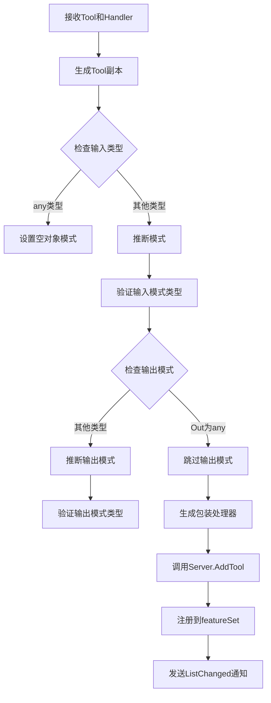

# MCP stdio 工具注册机制深度解析

## 概述

本文档深入探索了MCP (Model Context Protocol) Go SDK中的stdio工具注册机制，基于对 `go-sdk`源码的全面分析，总结出完整的工具注册流程、最佳实践和代码示例。

## 目录

1. [MCP stdio工具注册基本概念](#1-mcp-stdio工具注册基本概念)
2. [核心结构体和接口](#2-核心结构体和接口)
3. [工具注册流程](#3-工具注册流程)
4. [Stdio传输机制](#4-stdio传输机制)
5. [完整代码示例](#5-完整代码示例)
6. [最佳实践建议](#6-最佳实践建议)
7. [官方推荐使用模式](#7-官方推荐使用模式)
8. [常见错误和解决方案](#8-常见错误和解决方案)

---

## 1. MCP stdio工具注册基本概念

### 1.1 什么是MCP工具

MCP工具是服务器向客户端暴露的可调用功能单元，每个工具包含：

- **名称 (Name)**: 工具的唯一标识符
- **描述 (Description)**: 工具功能的说明
- **输入模式 (InputSchema)**: JSON Schema定义输入参数结构
- **输出模式 (OutputSchema)**: JSON Schema定义输出结果结构（可选）
- **处理器 (Handler)**: 实现工具逻辑的函数

### 1.2 stdio传输方式

MCP支持多种传输方式，其中 `StdioTransport`是最常用的方式：

- 通过标准输入(stdin)接收JSON-RPC消息
- 通过标准输出(stdout)发送JSON-RPC消息
- 每行一个JSON消息，使用换行符分隔
- 适用于命令行工具和桌面集成

### 1.3 三层架构模型

```
┌─────────────────────────────────────────────────┐
│                应用层 (Application Layer)               │
│  • 定义输入输出结构体                               │
│  • 实现工具处理器逻辑                               │
│  • 注册工具到服务器                                 │
└─────────────────┬───────────────────────────────────┘
                  │
┌─────────────────┴───────────────────────────────────┐
│              MCP服务器层 (MCP Server Layer)          │
│  • Server结构体 - 管理工具集合                       │
│  • AddTool函数 - 注册工具                           │
│  • Run方法 - 启动服务器                             │
└─────────────────┬───────────────────────────────────┘
                  │
┌─────────────────┴───────────────────────────────────┐
│              传输层 (Transport Layer)                 │
│  • StdioTransport - stdio传输实现                    │
│  • Connection接口 - 双向通信                         │
│  • JSON-RPC协议 - 消息编码解码                       │
└─────────────────────────────────────────────────┘
```

---

## 2. 核心结构体和接口

### 2.1 ToolHandler类型

```go
// 低级API，不进行预/后处理
type ToolHandler func(context.Context, *CallToolRequest) (*CallToolResult, error)
```

**特点**:

- 接收原始请求参数
- 不进行输入验证
- 返回结果不经过验证
- 需要手动处理错误和协议细节

**适用场景**: 高级用户，需要完全控制请求/响应处理

### 2.2 ToolHandlerFor泛型类型

```go
// 高级API，带类型安全和自动处理
type ToolHandlerFor[In, Out any] func(
    _ context.Context,
    request *CallToolRequest,
    input In
) (result *CallToolResult, output Out, _ error)
```

**特点**:

- 自动解组输入参数
- 自动验证输入模式
- 自动验证输出模式
- 自动处理错误（工具错误 vs 协议错误）
- 自动填充Content字段

**适用场景**: 大多数用户，简洁且符合MCP规范

### 2.3 Tool结构体

```go
type Tool struct {
    Name        string           `json:"name"`
    Description string           `json:"description,omitempty"`
    InputSchema any              `json:"inputSchema"`
    OutputSchema any             `json:"outputSchema,omitempty"`
    Icons       []Icon           `json:"icons,omitempty"`
}
```

**关键要求**:

- `InputSchema`不能为空
- 输入模式类型必须是"object"
- 输出模式类型必须是"object"（如果提供）
- 模式可以使用 `*jsonschema.Schema`或 `json.RawMessage`

### 2.4 Server结构体

```go
type Server struct {
    impl *Implementation
    opts ServerOptions

    mu                      sync.Mutex
    prompts                 *featureSet[*serverPrompt]
    tools                   *featureSet[*serverTool]
    resources               *featureSet[*serverResource]
    resourceTemplates       *featureSet[*serverResourceTemplate]
    sessions                []*ServerSession
    // ... 其他字段
}
```

**核心方法**:

- `NewServer()`: 创建服务器实例
- `AddTool()`: 注册工具到服务器
- `Run()`: 启动服务器
- `Connect()`: 连接到传输层

### 2.5 StdioTransport结构体

```go
type StdioTransport struct{}

// 连接到stdio传输
func (*StdioTransport) Connect(context.Context) (Connection, error) {
    return newIOConn(rwc{os.Stdin, nopCloserWriter{os.Stdout}}), nil
}
```

---

## 3. 工具注册流程

### 3.1 AddTool泛型函数

```go
func AddTool[In, Out any](s *Server, t *Tool, h ToolHandlerFor[In, Out])
```

**注册流程**:



### 3.2 模式推断机制

**输入模式推断**:

```go
func setSchema[T any](sfield *any, rfield **jsonschema.Resolved) (zero any, err error) {
    var internalSchema *jsonschema.Schema
    if *sfield == nil {
        rt := reflect.TypeFor[T]()
        if rt.Kind() == reflect.Pointer {
            rt = rt.Elem()
            zero = reflect.Zero(rt).Interface()
        }
        internalSchema, err = jsonschema.ForType(rt, &jsonschema.ForOptions{})
        if err == nil {
            *sfield = internalSchema
        }
    }
    // ...
}
```

**特点**:

- 自动从Go类型推断JSON Schema
- 支持结构体和映射类型
- 读取 `json`和 `jsonschema`标签
- 指针类型自动解引用

### 3.3 处理器包装

```go
func toolForErr[In, Out any](t *Tool, h ToolHandlerFor[In, Out]) (*Tool, ToolHandler, error)
```

**包装逻辑**:

1. **输入验证**:

   ```go
   input, err = applySchema(input, inputResolved)
   if err != nil {
       return nil, fmt.Errorf("%w: validating \"arguments\": %v", jsonrpc2.ErrInvalidParams, err)
   }
   ```
2. **参数解组**:

   ```go
   var in In
   if input != nil {
       if err := json.Unmarshal(input, &in); err != nil {
           return nil, fmt.Errorf("%w: %v", jsonrpc2.ErrInvalidParams, err)
       }
   }
   ```
3. **调用处理器**:

   ```go
   res, out, err := h(ctx, req, in)
   ```
4. **错误处理**:

   ```go
   if err != nil {
       if wireErr, ok := err.(*jsonrpc2.WireError); ok {
           return nil, wireErr
       }
       var errRes CallToolResult
       errRes.setError(err)
       return &errRes, nil
   }
   ```
5. **输出验证**:

   ```go
   outJSON, err = applySchema(outJSON, outputResolved)
   if err != nil {
       return nil, fmt.Errorf("validating tool output: %w", err)
   }
   res.StructuredContent = outJSON
   ```

---

## 4. Stdio传输机制

### 4.1 ioConn结构体

```go
type ioConn struct {
    protocolVersion string

    writeMu sync.Mutex         // 保护Write方法
    rwc     io.ReadWriteCloser // 底层流

    incoming <-chan msgOrErr   // 接收消息通道
    outgoingBatch []jsonrpc.Message // 批量发送队列

    queue []jsonrpc.Message // 未读消息队列

    batchMu sync.Mutex
    batches map[jsonrpc2.ID]*msgBatch // 批次跟踪

    closeOnce sync.Once
    closed    chan struct{}
    closeErr  error
}
```

### 4.2 消息读取流程

```go
func (t *ioConn) Read(ctx context.Context) (jsonrpc.Message, error) {
    // 检查关闭上下文
    select {
    case <-ctx.Done():
        return nil, ctx.Err()
    default:
    }

    // 处理队列中的消息
    if len(t.queue) > 0 {
        next := t.queue[0]
        t.queue = t.queue[1:]
        return next, nil
    }

    // 从通道接收消息
    var raw json.RawMessage
    select {
    case <-ctx.Done():
        return nil, ctx.Err()
    case v := <-t.incoming:
        if v.err != nil {
            return nil, v.err
        }
        raw = v.msg
    case <-t.closed:
        return nil, io.EOF
    }

    // 解析批次消息
    msgs, batch, err := readBatch(raw)
    if err != nil {
        return nil, err
    }

    // 处理批次（协议版本 >= 2025-06-18不支持批次）
    if batch && t.protocolVersion >= protocolVersion20250618 {
        return nil, fmt.Errorf("JSON-RPC batching is not supported in %s and later", protocolVersion20250618)
    }

    t.queue = msgs[1:] // 队列中保留剩余消息

    // 跟踪批次请求
    if batch {
        var respBatch *msgBatch
        for _, msg := range msgs {
            if req, ok := msg.(*jsonrpc.Request); ok {
                if respBatch == nil {
                    respBatch = &msgBatch{
                        unresolved: make(map[jsonrpc2.ID]int),
                    }
                }
                respBatch.unresolved[req.ID] = len(respBatch.responses)
                respBatch.responses = append(respBatch.responses, nil)
            }
        }
        if respBatch != nil {
            if err := t.addBatch(respBatch); err != nil {
                return nil, err
            }
        }
    }
    return msgs[0], err
}
```

### 4.3 消息写入流程

```go
func (t *ioConn) Write(ctx context.Context, msg jsonrpc.Message) error {
    // 检查关闭上下文
    select {
    case <-ctx.Done():
        return ctx.Err()
    default:
    }

    t.writeMu.Lock()
    defer t.writeMu.Unlock()

    // 处理响应消息（可能完成批次）
    if resp, ok := msg.(*jsonrpc.Response); ok {
        if batch, ok := t.updateBatch(resp); ok {
            if len(batch) > 0 {
                data, err := marshalMessages(batch)
                if err != nil {
                    return err
                }
                data = append(data, '\n')
                _, err = t.rwc.Write(data)
                return err
            }
            return nil
        }
    } else if len(t.outgoingBatch) < cap(t.outgoingBatch) {
        // 收集批次消息
        t.outgoingBatch = append(t.outgoingBatch, msg)
        if len(t.outgoingBatch) == cap(t.outgoingBatch) {
            data, err := marshalMessages(t.outgoingBatch)
            t.outgoingBatch = t.outgoingBatch[:0]
            if err != nil {
                return err
            }
            data = append(data, '\n')
            _, err = t.rwc.Write(data)
            return err
        }
        return nil
    }

    // 发送单个消息
    data, err := jsonrpc2.EncodeMessage(msg)
    if err != nil {
        return fmt.Errorf("marshaling message: %v", err)
    }
    data = append(data, '\n') // 换行符分隔
    _, err = t.rwc.Write(data)
    return err
}
```

---

## 5. 完整代码示例

### 5.1 基础示例（单工具服务器）

```go
package main

import (
    "context"
    "log"

    "github.com/modelcontextprotocol/go-sdk/mcp"
)

// 定义输入参数结构体
type SayHiParams struct {
    Name string `json:"name" jsonschema:"the name of the person to greet"`
}

// 实现工具处理器
// 注意：返回类型必须包含*mcp.CallToolResult
func SayHi(
    ctx context.Context,
    req *mcp.CallToolRequest,
    args SayHiParams
) (*mcp.CallToolResult, any, error) {
    // 返回文本内容
    return &mcp.CallToolResult{
        Content: []mcp.Content{
            &mcp.TextContent{Text: "Hi " + args.Name},
        },
    }, nil, nil
}

func main() {
    // 创建服务器
    server := mcp.NewServer(&mcp.Implementation{
        Name:    "greeter",
        Version: "v1.0.0",
    }, nil)

    // 注册工具
    mcp.AddTool(server, &mcp.Tool{
        Name:        "greet",
        Description: "say hi to someone",
    }, SayHi)

    // 启动服务器（stdio传输）
    if err := server.Run(context.Background(), &mcp.StdioTransport{}); err != nil {
        log.Fatal(err)
    }
}
```

### 5.2 完整功能示例（多工具服务器）

```go
package main

import (
    "context"
    "encoding/json"
    "log"

    "github.com/google/jsonschema-go/jsonschema"
    "github.com/modelcontextprotocol/go-sdk/mcp"
)

// ========== 工具1: 简单问候 ==========

type GreetArgs struct {
    Name string `json:"name" jsonschema:"the person to greet"`
}

func GreetTool(
    ctx context.Context,
    req *mcp.CallToolRequest,
    args GreetArgs
) (*mcp.CallToolResult, any, error) {
    return &mcp.CallToolResult{
        Content: []mcp.Content{
            &mcp.TextContent{Text: "Hello, " + args.Name + "!"},
        },
    }, nil, nil
}

// ========== 工具2: 结构化输出 ==========

type UserInfo struct {
    Name  string `json:"name"`
    Age   int    `json:"age"`
    Email string `json:"email,omitempty"`
}

type UserInfoArgs struct {
    UserID string `json:"user_id" jsonschema:"the ID of the user to retrieve"`
}

func UserInfoTool(
    ctx context.Context,
    req *mcp.CallToolRequest,
    args UserInfoArgs
) (*mcp.CallToolResult, *UserInfo, error) {
    // 返回结构化数据
    user := &UserInfo{
        Name:  "John Doe",
        Age:   30,
        Email: "john@example.com",
    }

    // 第三个返回值被自动放入StructuredContent
    // 如果Content为空，还会自动将JSON放入TextContent
    return nil, user, nil
}

// ========== 工具3: 带错误的工具 ==========

type ErrorArgs struct {
    Action string `json:"action"`
}

func ErrorTool(
    ctx context.Context,
    req *mcp.CallToolRequest,
    args ErrorArgs
) (*mcp.CallToolResult, any, error) {
    if args.Action == "fail" {
        // 返回工具错误（不是协议错误）
        return nil, nil, fmt.Errorf("this is a tool error, not a protocol error")
    }
    return &mcp.CallToolResult{
        Content: []mcp.Content{
            &mcp.TextContent{Text: "Action completed: " + args.Action},
        },
    }, nil, nil
}

// ========== 主函数 ==========

func main() {
    server := mcp.NewServer(&mcp.Implementation{
        Name:    "example-server",
        Version: "v1.0.0",
    }, &mcp.ServerOptions{
        Instructions: "Use these tools to interact with the system.",
        Logger:       log.New(os.Stderr, "[server] ", log.LstdFlags),
    })

    // 注册多个工具
    mcp.AddTool(server, &mcp.Tool{
        Name:        "greet",
        Description: "greet someone",
    }, GreetTool)

    mcp.AddTool(server, &mcp.Tool{
        Name:        "get_user_info",
        Description: "get user information",
        // 可以显式指定模式（如果不指定会自动推断）
        OutputSchema: &jsonschema.Schema{
            Type: "object",
            Properties: map[string]*jsonschema.Schema{
                "name":  {Type: "string"},
                "age":   {Type: "integer"},
                "email": {Type: "string"},
            },
        },
    }, UserInfoTool)

    mcp.AddTool(server, &mcp.Tool{
        Name:        "error_demo",
        Description: "demonstrate error handling",
    }, ErrorTool)

    // 使用LoggingTransport记录消息
    if err := server.Run(
        context.Background(),
        &mcp.LoggingTransport{
            Transport: &mcp.StdioTransport{},
            Writer:    os.Stderr,
        },
    ); err != nil {
        log.Fatal(err)
    }
}
```

### 5.3 自定义传输示例（HTTP）

```go
package main

import (
    "context"
    "log"
    "net/http"

    "github.com/modelcontextprotocol/go-sdk/mcp"
)

// 创建HTTP传输处理器
func createServer() *mcp.Server {
    server := mcp.NewServer(&mcp.Implementation{
        Name:    "http-server",
        Version: "v1.0.0",
    }, nil)

    // 注册工具
    mcp.AddTool(server, &mcp.Tool{
        Name:        "ping",
        Description: "ping the server",
    }, func(ctx context.Context, req *mcp.CallToolRequest, _ any) (*mcp.CallToolResult, any, error) {
        return &mcp.CallToolResult{
            Content: []mcp.Content{
                &mcp.TextContent{Text: "pong"},
            },
        }, nil, nil
    })

    return server
}

func main() {
    // 使用流式HTTP处理器
    handler := mcp.NewStreamableHTTPHandler(
        func(*http.Request) *mcp.Server {
            return createServer()
        },
        nil,
    )

    log.Println("HTTP MCP server listening on :8080")
    log.Fatal(http.ListenAndServe(":8080", handler))
}
```

---

## 6. 最佳实践建议

### 6.1 输入参数设计

**✅ 推荐做法**:

```go
// 使用结构体提供清晰的模式和文档
type ListFilesArgs struct {
    Path    string `json:"path" jsonschema:"the directory path to list"`
    Filter  string `json:"filter,omitempty" jsonschema:"file name filter pattern"`
    MaxCount int   `json:"max_count" jsonschema:"maximum number of files to return (default: 100)"`
}

// 添加验证逻辑
func ListFilesTool(
    ctx context.Context,
    req *mcp.CallToolRequest,
    args ListFilesArgs
) (*mcp.CallToolResult, any, error) {
    if args.MaxCount <= 0 || args.MaxCount > 1000 {
        return nil, nil, fmt.Errorf("max_count must be between 1 and 1000")
    }
    // ...
}
```

**❌ 避免做法**:

```go
// 避免使用map[string]any（失去类型安全和文档）
func BadTool(ctx context.Context, req *mcp.CallToolRequest, args map[string]any) (*mcp.CallToolResult, any, error) {
    // ...
}
```

### 6.2 输出处理

**✅ 结构化输出**:

```go
type Result struct {
    Count   int    `json:"count"`
    Message string `json:"message"`
}

func MyTool(ctx context.Context, req *mcp.CallToolRequest, args Args) (*mcp.CallToolResult, *Result, error) {
    return nil, &Result{
        Count:   10,
        Message: "success",
    }, nil
    // 返回的Result自动放入StructuredContent
    // 如果Content为空，还会生成TextContent包含JSON
}
```

**✅ 错误处理**:

```go
func RobustTool(ctx context.Context, req *mcp.CallToolRequest, args Args) (*mcp.CallToolResult, any, error) {
    // 工具错误（用户可见，不会终止连接）
    if !validateInput(args) {
        return nil, nil, fmt.Errorf("invalid input: missing required field")
    }

    // 协议错误（连接级别错误）
    if req.Params == nil {
        return nil, nil, &jsonrpc2.WireError{
            Code:    jsonrpc2.ErrInvalidParams.Code,
            Message: "missing parameters",
        }
    }

    return &mcp.CallToolResult{
        Content: []mcp.Content{
            &mcp.TextContent{Text: "success"},
        },
    }, nil, nil
}
```

### 6.3 工具注册模式

**✅ 清晰分离关注点**:

```go
// 1. 定义类型和处理器
type AddArgs struct {
    A int `json:"a"`
    B int `json:"b"`
}

func AddTool(ctx context.Context, req *mcp.CallToolRequest, args AddArgs) (*mcp.CallToolResult, any, error) {
    return &mcp.CallToolResult{
        Content: []mcp.Content{
            &mcp.TextContent{Text: fmt.Sprintf("%d", args.A + args.B)},
        },
    }, nil, nil
}

// 2. 创建服务器
server := mcp.NewServer(&mcp.Implementation{
    Name:    "calculator",
    Version: "v1.0.0",
}, nil)

// 3. 注册工具
mcp.AddTool(server, &mcp.Tool{
    Name:        "add",
    Description: "add two numbers",
}, AddTool)
```

**❌ 避免内联所有内容**:

```go
// 避免这种做法（难以维护和测试）
server := mcp.NewServer(impl, nil)
mcp.AddTool(server, &mcp.Tool{Name: "x"}, func(ctx context.Context, req *mcp.CallToolRequest, args T) (*mcp.CallToolResult, any, error) {
    // 大量内联代码...
})
```

### 6.4 错误处理策略

**分层错误处理**:

```go
// 1. 输入验证错误（工具级别）
func MyTool(ctx context.Context, req *mcp.CallToolRequest, args Args) (*mcp.CallToolResult, any, error) {
    if err := validateArgs(args); err != nil {
        return nil, nil, fmt.Errorf("validation failed: %w", err)
    }
    // ...
}

// 2. 业务逻辑错误（工具级别）
func MyTool(ctx context.Context, req *mcp.CallToolRequest, args Args) (*mcp.CallToolResult, any, error) {
    result, err := doBusinessLogic(args)
    if err != nil {
        // 转换为用户友好的错误消息
        return nil, nil, fmt.Errorf("operation failed: %v", err)
    }
    return &mcp.CallToolResult{
        StructuredContent: result,
    }, nil, nil
}

// 3. 协议错误（服务器级别）
func MyTool(ctx context.Context, req *mcp.CallToolRequest, args Args) (*mcp.CallToolResult, any, error) {
    if req.Session == nil {
        // 这是一个协议错误
        return nil, nil, &jsonrpc2.WireError{
            Code:    jsonrpc2.ErrInvalidRequest.Code,
            Message: "missing session",
        }
    }
    // ...
}
```

---

## 7. 官方推荐使用模式

### 7.1 标准MCP服务器模式

```go
package main

import (
    "context"
    "log"

    "github.com/modelcontextprotocol/go-sdk/mcp"
)

func main() {
    // 1. 创建服务器实例
    server := mcp.NewServer(&mcp.Implementation{
        Name:    "your-server-name",
        Version: "v1.0.0",
    }, &mcp.ServerOptions{
        Instructions: "向用户提供使用说明",
        Logger:       log.New(os.Stderr, "[server] ", log.LstdFlags),
    })

    // 2. 注册所有工具
    registerTools(server)

    // 3. 启动服务器（stdio传输）
    if err := server.Run(context.Background(), &mcp.StdioTransport{}); err != nil {
        log.Fatal(err)
    }
}

func registerTools(server *mcp.Server) {
    // 为每个工具调用AddTool
    mcp.AddTool(server, &mcp.Tool{
        Name:        "tool1",
        Description: "工具1描述",
    }, tool1Handler)

    mcp.AddTool(server, &mcp.Tool{
        Name:        "tool2",
        Description: "工具2描述",
    }, tool2Handler)

    // ...
}
```

### 7.2 客户端连接模式

```go
package main

import (
    "context"
    "log"
    "os/exec"

    "github.com/modelcontextprotocol/go-sdk/mcp"
)

func main() {
    ctx := context.Background()

    // 创建客户端
    client := mcp.NewClient(&mcp.Implementation{
        Name:    "example-client",
        Version: "v1.0.0",
    }, nil)

    // 连接到服务器（stdio传输）
    transport := &mcp.CommandTransport{
        Command: exec.Command("your-server-binary"),
    }

    session, err := client.Connect(ctx, transport, nil)
    if err != nil {
        log.Fatal(err)
    }
    defer session.Close()

    // 调用工具
    res, err := session.CallTool(ctx, &mcp.CallToolParams{
        Name: "tool1",
        Arguments: map[string]any{
            "param1": "value1",
        },
    })
    if err != nil {
        log.Fatal(err)
    }

    // 处理结果
    for _, content := range res.Content {
        if text, ok := content.(*mcp.TextContent); ok {
            log.Print(text.Text)
        }
    }
}
```

### 7.3 工具设计原则

**输入模式设计**:

```go
type ToolArgs struct {
    RequiredField string `json:"required_field" jsonschema:"required field description"`
    OptionalField string `json:"optional_field,omitempty" jsonschema:"optional field description"`

    // 使用enum限制取值
    Type string `json:"type" jsonschema:"type of operation" jsonschema:"enum=create,enum=update,enum=delete"`
}
```

**输出模式设计**:

```go
type ToolResult struct {
    Success bool   `json:"success"`
    Message string `json:"message,omitempty"`

    // 嵌套对象
    Data struct {
        ID   string `json:"id"`
        Name string `json:"name"`
    } `json:"data,omitempty"`

    // 数组
    Items []Item `json:"items,omitempty"`
}
```

---

## 8. 常见错误和解决方案

### 8.1 错误: "missing input schema"

**原因**: 注册工具时 `Tool.InputSchema`为 `nil`

**解决方案**:

```go
// ❌ 错误
mcp.AddTool(server, &mcp.Tool{
    Name:        "bad_tool",
    Description: "missing schema",
}, handler)

// ✅ 正确 - 使用泛型AddTool自动推断模式
mcp.AddTool(server, &mcp.Tool{
    Name:        "good_tool",
    Description: "has schema",
}, func(ctx context.Context, req *mcp.CallToolRequest, args Args) (*mcp.CallToolResult, any, error) {
    return nil, nil, nil
})

// ✅ 正确 - 显式提供模式
mcp.AddTool(server, &mcp.Tool{
    Name:        "explicit_tool",
    Description: "explicit schema",
    InputSchema: &jsonschema.Schema{
        Type: "object",
        Properties: map[string]*jsonschema.Schema{
            "field": {Type: "string"},
        },
    },
}, lowLevelHandler)
```

### 8.2 错误: "input schema must have type \"object\""

**原因**: 输入模式类型不是"object"

**解决方案**:

```go
// ❌ 错误 - 数组类型
InputSchema: &jsonschema.Schema{
    Type: "array",
    Items: &jsonschema.Schema{Type: "string"},
}

// ✅ 正确 - 对象类型
InputSchema: &jsonschema.Schema{
    Type: "object",
    Properties: map[string]*jsonschema.Schema{
        "items": {
            Type: "array",
            Items: &jsonschema.Schema{Type: "string"},
        },
    },
}
```

### 8.3 错误: 工具返回类型不匹配

**原因**: Handler返回类型与泛型类型参数不匹配

**解决方案**:

```go
// ❌ 错误
func BadHandler(ctx context.Context, req *mcp.CallToolRequest, args Args) (*mcp.CallToolResult, *WrongType, error) {
    return nil, nil, nil
}
mcp.AddTool[Args, WrongType](server, tool, BadHandler) // 类型不匹配

// ✅ 正确
func GoodHandler(ctx context.Context, req *mcp.CallToolRequest, args Args) (*mcp.CallToolResult, CorrectType, error) {
    return nil, CorrectType{}, nil
}
mcp.AddTool[Args, CorrectType](server, tool, GoodHandler)
```

### 8.4 错误: 协议版本不兼容

**原因**: 使用了不支持的JSON-RPC批次功能

**解决方案**:

```go
// 在新版本协议中（>= 2025-06-18），JSON-RPC批次被禁用
// 确保不发送批次消息

// ✅ 正确 - 发送单个消息
for _, msg := range messages {
    if err := conn.Write(ctx, msg); err != nil {
        return err
    }
}
```

### 8.5 工具描述和文档

**使用结构化文档**:

```go
type FileListArgs struct {
    Path string `json:"path" jsonschema:"the directory path to list files from"`
}

func FileListTool(ctx context.Context, req *mcp.CallToolRequest, args FileListArgs) (*mcp.CallToolResult, any, error) {
    // 工具实现
}

mcp.AddTool(server, &mcp.Tool{
    Name:        "list_files",
    Description: "List files in a directory with filtering and pagination support",
}, FileListTool)
```

---

## 总结

MCP stdio工具注册机制通过泛型编程和类型推断，为Go开发者提供了简洁而强大的API。核心要点：

1. **使用 `AddTool[In, Out]`泛型函数**进行工具注册，自动处理模式推断和验证
2. **定义清晰的输入输出结构体**，使用 `jsonschema`标签提供文档
3. **遵循MCP规范**，确保工具符合协议要求
4. **正确处理错误**，区分工具错误和协议错误
5. **使用StdioTransport**进行标准输入输出通信

通过遵循最佳实践和官方推荐模式，可以构建出健壮、可维护的MCP服务器。

---

## 参考资源

- [MCP官方协议规范](https://modelcontextprotocol.io/)
- [Go SDK文档](https://pkg.go.dev/github.com/modelcontextprotocol/go-sdk/mcp)
- [示例代码目录](./go-sdk/examples/)
- [JSON Schema规范](https://json-schema.org/)
